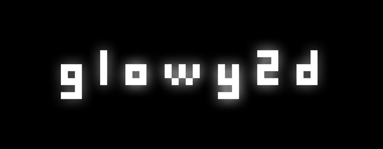

# glowy2d

This is a framework for creating 2d applications made for educational purposes/

## Dependencies

- boost
- cpptoml
- OpenGL, GLEW, glfw3
- zlib, libpng

## How to build

```
mkdir build
cd build
cmake ..
make -j4
```

## Examples

There are 2 examples.

- **Triangle example**. Unfortunately, with no triange (because it's work in progress), only black screen
- **Simple platformer**. This one works.

To get an example working, you should copy contents of corresponding directory in `res/test` directory to the same place where output binary is located. For example, after you `make` the project, copy everything from `res/test/SamplePlatformer` to `build/test/SamplePlatformer` and run `sampleplatformer`.
